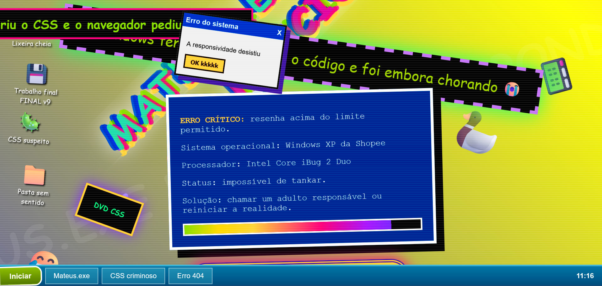

# Mateus.exe Apocalipse Edition

Um site caótico, visualmente exagerado e propositalmente bugado, criado para simular um sistema operacional em colapso onde o Mateus.exe simplesmente parou de funcionar.

O projeto mistura estética de Windows XP, erro de sistema, tela azul, pop-ups aleatórios, chuva de elementos visuais, glitch, animações intensas e botões que claramente não deveriam ser clicados.

## Sumário

* [Preview](#preview)
* [Sobre o projeto](#sobre-o-projeto)
* [Tecnologias utilizadas](#tecnologias-utilizadas)
* [Funcionalidades](#funcionalidades)
* [Como funciona](#como-funciona)
* [Como executar](#como-executar)
* [Estrutura do projeto](#estrutura-do-projeto)
* [Destaques do projeto](#destaques-do-projeto)
* [Melhorias futuras](#melhorias-futuras)
* [Autor](#autor)
* [License](#license)

## Preview



## Sobre o projeto

Este projeto foi desenvolvido com foco em humor, criatividade e experimentação visual.

A proposta é criar uma página extremamente animada, exagerada e com aparência de sistema corrompido, utilizando apenas HTML, CSS e JavaScript puro, sem frameworks ou bibliotecas externas.

O resultado é uma experiência visual propositalmente caótica, com elementos que simulam falhas de sistema, pop-ups, tela azul, ícones de desktop e uma interface inspirada em sistemas antigos.

## Tecnologias utilizadas

* HTML5
* CSS3
* JavaScript Vanilla

## Funcionalidades

* Fundo animado com gradiente multicolorido
* Efeito de scanline simulando tela antiga
* Texto principal com efeito glitch
* Ícones falsos de desktop
* Barra de tarefas inspirada no Windows XP
* Botão que intensifica o caos visual
* Pop-ups aleatórios com mensagens de erro
* Elementos visuais surgindo dinamicamente na tela
* Rastro animado no cursor do mouse
* Relógio funcional na barra inferior
* Tela azul fake ao clicar no botão proibido
* Interações feitas com JavaScript puro

## Como funciona

O projeto utiliza várias animações CSS com `@keyframes` para criar efeitos visuais como:

* Tremedeira
* Glitch
* Rotação
* Mudança de cores
* Movimento contínuo de elementos
* Fundo animado
* Simulação de tela azul

No JavaScript, são criadas interações dinâmicas como:

* Geração automática de pop-ups
* Criação de elementos visuais aleatórios
* Efeito de rastro no movimento do mouse
* Controle da tela azul fake
* Atualização do relógio em tempo real
* Aumento progressivo do caos ao clicar no botão principal

## Como executar

Clone este repositório:

```bash
git clone https://github.com/TeuzLins/serpro-projeto.git
```

Acesse a pasta do projeto:

```bash
cd serpro-projeto
```

Abra o arquivo `index.html` diretamente no navegador.

Também é possível executar com a extensão Live Server no VS Code:

1. Instale a extensão Live Server
2. Clique com o botão direito no arquivo `index.html`
3. Selecione a opção `Open with Live Server`

## Estrutura do projeto

```bash
/
├── assets/
│   └── sitememe.png
├── index.html
├── README.md
├── LICENSE
└── .gitignore
```

## Destaques do projeto

Algumas mensagens e ideias presentes no site:

* Mateus.exe parou de funcionar
* CSS recusou atendimento
* HTML pediu férias
* Erro 404: bom senso não encontrado
* Windows mandou currículo para outra empresa
* A responsividade desistiu

## Melhorias futuras

* Adicionar sons de erro inspirados em sistemas antigos
* Criar um modo de caos extremo
* Adicionar botão para restaurar o sistema
* Criar contador de cliques nos botões
* Separar o CSS em um arquivo próprio
* Separar o JavaScript em um arquivo próprio
* Melhorar a responsividade para telas menores
* Adicionar novas telas falsas de erro

## Autor

<table>
  <tr>
    <td align="center">
      <a href="https://github.com/TeuzLins">
        
        <br />
        <sub><b>Teuz Lins</b></sub>
      </a>
      <br />
      <a href="https://github.com/russo313" title="Rocketseat">Backend Developer</a>
    </td>
  </tr>
</table>

<div align="center">

## License

Este projeto está sob a Apache License 2.0.
Consulte o arquivo [LICENSE](./LICENSE) para mais detalhes.

</div>
